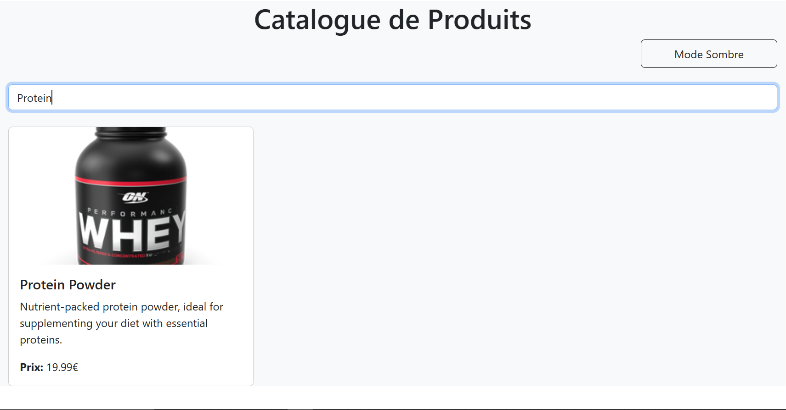
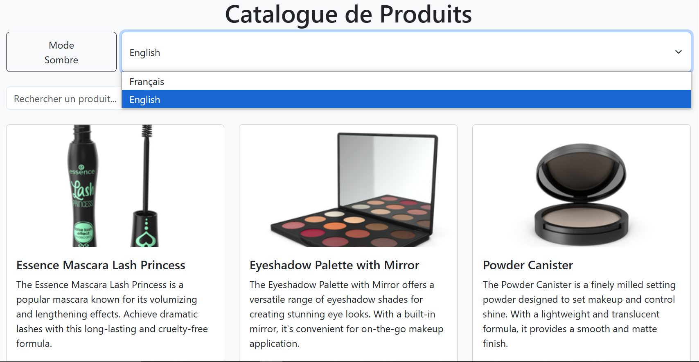

# TP React Hooks - Application de Gestion de Produits

Ce TP a pour objectif de mettre en pratique l'utilisation des Hooks React (useState, useEffect, useContext) ainsi que la création de Hooks personnalisés.

## Installation et configuration initiale

1. Cloner le dépôt :

```bash
git clone https://github.com/pr-daaif/tp-react-hooks.git
cd tp-react-hooks
```

2. Créer votre propre dépôt sur Github et changer le remote :

```bash
# Supprimer le remote origine
git remote remove origin

# Ajouter votre nouveau remote
git remote add origin https://github.com/[votre-username]/tp-react-hooks.git

# Premier push
git push -u origin main
```

3. Installer les dépendances :

```bash
npm install
```

4. Lancer l'application :

```bash
npm start
```

## Instructions pour le TP

Pour chaque exercice :

1. Lisez attentivement l'énoncé
2. Implémentez la solution
3. Testez votre implémentation (pensez à faire des copies d'écran)
4. Mettez à jour la section correspondante dans ce README avec :
   - Une brève explication de votre solution
   - Des captures d'écran montrant le fonctionnement
   - Les difficultés rencontrées et comment vous les avez résolues
5. Commitez vos changements avec un message descriptif

### Exercice 1 : État et Effets

#### Objectif : Implémenter une recherche en temps réel

- [ ] 1.1 Modifier le composant ProductSearch pour utiliser la recherche
- [ ] 1.2 Implémenter le debounce sur la recherche
- [ ] 1.3 Documenter votre solution ici

_Votre réponse pour l'exercice 1 :_

```
Expliquez votre solution ici
1.1 : J'ai modifié le composant ProductSearch pour utiliser la recherche en temps réel. J'ai utilisé l'état local pour stocker la valeur de la recherche et j'ai utilisé l'effet pour mettre à jour les produits filtrés à chaque changement de la valeur de recherche.
1.2 : J'ai implémenté le debounce sur la recherche en utilisant un hook personnalisé useDebounce qui prend en paramètre la valeur de recherche et le délai de debounce. J'ai utilisé ce hook pour déclencher la recherche après un délai de 500ms.
```

Cette solution m'a permis de gérer la recherche en temps réel et d'éviter de déclencher une recherche à chaque changement de la valeur de recherche.

Cette capture d'écran montre le fonctionnement de la recherche en temps réel avec le debounce.
Une seule recherche est déclenchée après un délai de 500ms après le dernier changement de la valeur de recherche.


### Exercice 2 : Context et Internationalisation

#### Objectif : Gérer les préférences de langue

- [ ] 2.1 Créer le LanguageContext
- [ ] 2.2 Ajouter le sélecteur de langue
- [ ] 2.3 Documenter votre solution ici

_Votre réponse pour l'exercice 2 :_

```
Expliquez votre solution ici
2.1 : J'ai créé le contexte LanguageContext pour stocker la langue actuelle et la fonction pour changer la langue.
2.2 : J'ai ajouté le sélecteur de langue dans le composant App pour permettre à l'utilisateur de changer la langue de l'application.

```

2.3

###Exercice 3 : Hooks Personnalisés

#### Objectif : Créer des hooks réutilisables

- [ ] 3.1 Créer le hook useDebounce
- [ ] 3.2 Créer le hook useLocalStorage
- [ ] 3.3 Documenter votre solution ici

_Votre réponse pour l'exercice 3 :_

```
Expliquez votre solution ici
3.1 : J'ai créé le hook useDebounce pour gérer le debounce sur la recherche. Ce hook prend en paramètre la valeur à débouncer et le délai de debounce. Il utilise l'état local pour stocker la valeur débouncée et l'effet pour mettre à jour la valeur débouncée après le délai de debounce.
3.2 : J'ai créé le hook useLocalStorage pour gérer la persistance des préférences de langue. Ce hook prend en paramètre la clé de stockage et la valeur par défaut. Il utilise l'état local pour stocker la valeur et l'effet pour mettre à jour la valeur dans le stockage local.
```

[Ajoutez vos captures d'écran]

```

### Exercice 4 : Gestion Asynchrone et Pagination

#### Objectif : Gérer le chargement et la pagination

- [ ] 4.1 Ajouter le bouton de rechargement
- [ ] 4.2 Implémenter la pagination
- [ ] 4.3 Documenter votre solution ici

_Votre réponse pour l'exercice 4 :_

```

Expliquez votre solution ici
4.1 : J'ai ajouté le bouton de rechargement dans le composant ProductList pour permettre à l'utilisateur de recharger les produits.
4.2 : J'ai implémenté la pagination dans le composant ProductList pour afficher les produits par page. J'ai utilisé l'état local pour stocker le numéro de la page actuelle et j'ai utilisé l'effet pour mettre à jour les produits affichés à chaque changement de la page.

```

```


## Rendu

- Ajoutez l'URL de votre dépôt Github dans **Classroom** et envoyer la réponse dès le démarage de votre projet.
- Les push doivent se faire au fûr et à mesure que vous avancez dans votre projet.
- Le README.md doit être à jour avec vos réponses et captures d'écran.
- Chaques exercice doit faire l'objet d'au moins un commit avec un message mentionnant le numéro de l'exercice.
